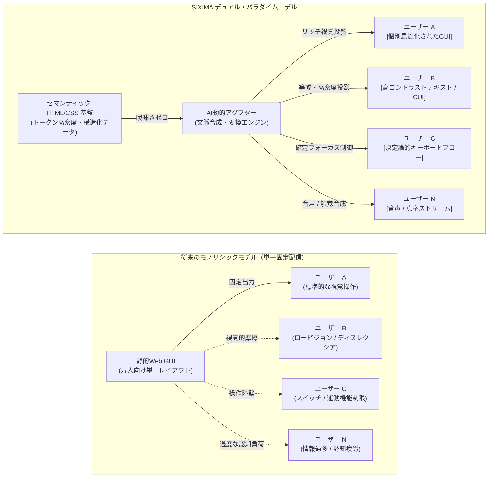
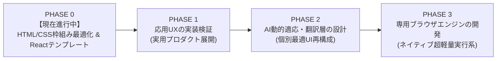

# SIXIMA

> **デュアル・パラダイム・インターフェース・アーキテクチャ: 普遍的な人間アクセシビリティ × 自律型AIエージェントの同期**

[](https://github.com/sixima/sixima)
[](https://www.jaist.ac.jp/)
[](https://github.com/sixima/sixima)
[](LICENSE)

---

## 01 / マニフェスト: デュアル・パラダイムの必然性

**北陸先端科学技術大学院大学（JAIST）**で発足した **SIXIMA** は、オープンソースのインターフェース研究開発イニシアチブです。私たちは極めて実利的なテーゼのもとで活動しています。

> **私たちはGUI（グラフィカル・ユーザー・インターフェース）を否定しません。視覚的コンピューティングは人類が生み出した最も強力な認知拡張ツールのひとつです。しかし、すべての人類にとって常に最適な「単一の静的GUI」は存在しません。**

### 静的なユニバーサルデザインから、AIによる個別最適化へ
これまで数十年間、インターフェースデザインは「ユニバーサルデザイン」――万人を1つの画面レイアウトで包摂しようとする試み――を追求してきました。しかし現実には、全員に向けた単一のデザインは無数の妥協を生み、視覚的ノイズの肥大化、非セマンティックなラッパーの多重ネスト、硬直した操作前提をもたらし、感覚・身体・認知特性に多様性を持つ人々に深刻な摩擦を与えています。

自律型AIとマルチモーダル生成技術の発展により、**もはや全員を同一の視覚的鋳型に押し込める必要はありません。**
* **視覚認知が得意な人へ:** 高密度で情報豊かなグラフィカル投影やチャート。
* **認知疲労を最小限に抑えたい・直線的に集中したい人へ:** ハイコントラストで決定論的なテキストファースト表示。
* **非視覚または触覚での操作を必要とする人へ:** 直接的な音声合成ストリームや点字ディスプレイ出力。

SIXIMA は実験的な取り組みですが、その目的は極めて現実的です。ソフトウェアに人間を合わせさせるのではなく、**ソフトウェアが各人の状態へと動的に適応する新たなパラダイム**を提示します。

---

### 現実的な基盤: HTML + CSSによる「デザイン意図」の伝達

1. **HTML + CSS は作者のデザイン意図を内包する（単なるJSONを超えて）:**  
   構造化データを渡すだけなら JSON でも事足ります。しかし、純粋なデータフォーマットは作者の**「グラフィカルデザインの意図」**――視覚的優先度、グループ化、強調、空間的距離、情緒的トーン――を完全に脱落させます。AIが裸の JSON から画面を再構築しようとすると、「何が重要か」を推測せざるを得ず、**深刻なハルシネーション（誤認・捏造）や意図の伝達ミス**を招きます。  
   * **HTML** は意味論と関係構造（`<main>`, `<section>`, `<mark>`, `<table>`, `<aside>` 等）を伝達します。  
   * **CSS** は作者の視覚的意図（重み付け、階層構造、近接性、コントラスト）を伝達します。  
   標準の HTML/CSS には、GUI・CUI・音声ツリー・点字など、あらゆるUI/UXを意図のブレなく再構築するのに十分な冗長性と表現力が備わっています。

2. **二重管理の撤廃（開発者と環境の負担軽減）:**  
   開発者は、画面用コードとは別に「AI用・アクセシビリティ用の独自JSONスキーマ」を二重管理・保守する必要がありません。標準に準拠したセマンティックなWebコードを書くだけで、人間向けの視覚画面と、機械が読む高精度な基盤データが同時に成立します。

3. **既存ブラウザエンジンの無改造動作:**  
   SIXIMA は独自の実験的ブラウザや特殊な WebAssembly ランタイムを強制しません。**既存の標準ブラウザエンジン（Chromium, WebKit, Gecko）上で 100% ネイティブに動作**します。

4. **後付けではなく組み込まれたアクセシビリティ:**  
   アクセシビリティは、開発の最後に付与する応急処置（ARIAパッチ）ではありません。DOMの平坦化、燐光グリーン級の高輝度コントラスト、予測可能なキーボード移動、決定論的な状態遷移は、コードの1行目から組み込まれた最上位のアーキテクチャ制約です。

---

## 02 / デュアル・パラダイム・アーキテクチャ

SIXIMA は、**「意味の基底構造（Semantic Truth）」** と **「動的な投影（Ephemeral Projection）」** を完全に分離します。クリーンで決定論的なマークアップを単一の真実とし、AIがリアルタイムに個別最適なインターフェースを生成します。



1. **セマンティック基盤層:** アプリケーションは、過剰な装飾ラッパーを排除したトークン効率の高い HTML/CSS で構築されます。
2. **AI動的適応層:** 機械エージェントがこの構造ツリーを誤読なく読み取り、利用者の身体的・認知的・環境的ニーズに合わせた最適なモダリティへとリアルタイム変換します。

---

## 03 / コア設計指針

### 普遍的なマルチセンサリー・インクルージョン

* **視覚的明瞭性:** 厳格な1pxボーダー、等幅フォント、高輝度コントラストにより、眼精疲労を防ぎ、ロービジョン環境での視認性を極大化。
* **非視覚・触覚の等価性:** スクリーンリーダーや点字ディスプレイがゴミ構造に引っかかることなく走査できるフラットなDOM構造。キーボードおよび単一スイッチによる完全操作を保証。
* **認知負荷の極小化:** レイアウトシフト（CLS）の完全排除、唐突なポップオーバーの禁止、無意味な装飾アニメーションの撤廃により、ニューロダイバージェントの認知的疲労を軽減。

### エージェント向けトークン最適化

* **コンテキスト長の圧縮:** 意味のない `<div>` の多重ネストを排除することで、AIエージェントがDOMを走査する際のトークン消費を最大70%削減。
* **決定論的アクション面:** 明確なセマンティック要素により、自律エージェントが誤認なくUIを特定・操作・検証可能。

### 単なるUIを超えた「応用UX（実用人間工学）」

* 入力遅延の極小化、省電力性、認知速度を含めた総合的な人間工学を設計対象とします。
* 高密度・高頻度操作が求められる公共交通運行クライアント **`JAIBUS-app`** などの実プロダクトを通じて、実効性を検証しています。

---

## 04 / 哲学的議論とFAQ

### Q1: GUIをすべて捨てて、Webを昔のCUI/ターミナルに戻そうとしているのですか？

**回答:** いいえ、全く違います。GUIは空間把握や直感的探索において極めて有用です。問題なのは「GUIしかないこと」「全員に同じ1つのGUIを強要すること」です。私たちがテキストファーストの参照実装を用いるのは、テキストが人間と機械の共通理解において最も密度が高く、曖昧さがないからです。ここから高品質なGUIも音声も正確に再構成できます。

### Q2: なぜJSONではなく標準のHTML/CSSを使うのですか？

**回答:** JSONは純粋な値しか持たず、作者のデザイン意図（視覚的ヒエラルキー、強調、グループ化）を捨ててしまいます。その結果、AIが画面を復元する際に「どれを大きく表示すべきか」を勝手に推測（ハルシネーション）してしまいます。HTMLで構造を、CSSでデザインの重み付けを伝えることで、伝達ミスを極小化できます。また、ブラウザ標準のアクセシビリティAPIをそのまま活かせる利点もあります。

### Q3: 既存のブラウザで本当にそのまま動くのですか？

**回答:** はい。SIXIMA はWeb標準技術、セマンティックHTML、CSSカスタムプロパティのみで構成されています。Chromium、Safari（WebKit）、Firefox（Gecko）など、現在お使いのブラウザでそのまま高速に動作します。

---

## 05 / 開発ロードマップ

SIXIMA は4つの段階を経て進化します。現在は **Phase 0** を実行中です。



### 【PHASE 0: HTML/CSS枠組みの最適化 & Reactテンプレート】 — 現在のフェーズ

* **主目的:** 既存ブラウザの枠組み内で、HTML/CSS のセマンティック最適化、トークン密度の極大化、認知負荷の低減を徹底検証する。
* **具体的ゴール:** `sixima-ui` Reactテンプレートおよびコンポーネント標準を策定する。
* **参照実装:** **SIXIMA公式サイトそのものを、このUI/UXの完全なサンプル実装（オープンソース）として構築・公開する。**

### 【PHASE 1: 現場での応用UX検証 & ストレステスト】

* **主目的:** ネットワーク帯域やハードウェア制約の厳しい現場環境で、高速な意思決定を支える実用人間工学を検証する。
* **具体的ゴール:** 実運用アプリケーション（`JAIBUS-app` 等）をリリースし、キーボード完結操作や支援技術との同期精度を実証する。

### 【PHASE 2: AI動的適応・翻訳層の設計】

* **主目的:** 構造化されたHTML/CSSを入力とし、利用者の困難に応じた最適なUI/UXを動的に再構成するAI翻訳層を設計・実装する。
* **具体的ゴール:** セマンティック基盤から「リッチGUI」「高密度テキスト」「音声ストリーム」「点字出力」などをハルシネーションなく生成するエージェントアダプターを構築する。

### 【PHASE 3: 専用ブラウザエンジンの開発】

* **主目的:** 巨大化した既存ブラウザエンジン（Chromium/WebKit）のオーバーヘッドから脱却する。
* **具体的ゴール:** トークンシリアライズ、ゼロレイアウトシフト、支援機器ネイティブ同期に特化した、独立した超軽量ブラウザエンジンを研究開発する。

---

## 06 / リポジトリ構成

```
sixima/
├── packages/
│   ├── sixima-core/          # コア仕様、トークンパーサー、DOM規約
│   ├── sixima-ui/            # ゼロ依存 React & CSS ターミナルコンポーネント
│   └── sixima-tokens/        # 等幅メトリクス & 燐光パレット定義
├── apps/
│   ├── official-portal/      # SIXIMA 公式参照プラットフォーム (Phase 0)
│   └── jaibus-app/           # 高密度交通運行クライアント (Phase 1)
├── benchmarks/               # トークン消費・アクセシビリティ計測テスト群
└── docs/                     # 仕様書、ホワイトペーパー、監査記録

```

---

## 07 / はじめ方

### 前提条件

* Node.js `>= 18.0.0`
* npm / pnpm / yarn

### インストールとローカル起動

```bash
# リポジトリのクローン
git clone [https://github.com/sixima/sixima.git](https://github.com/sixima/sixima.git)
cd sixima

# 依存パッケージのインストール
npm install

# 開発サーバーの起動
npm run dev

```

---

## 08 / オープンな実験への招待（コントリビューション）

SIXIMA は進化を続けるオープンな研究実験です。トークンパーサー、コンポーネント仕様、人間工学ワークフローは常に検証され、再設計されています。

ソフトウェアエンジニア、デザイナー、アクセシビリティ研究者、AI開発者の参加を歓迎します。

* **アクセシビリティ監査:** スクリーンリーダー、単一スイッチ、視線入力装置、点字ディスプレイでの挙動検証。
* **コンポーネント開発:** `sixima-ui` プリミティブの拡充、CSSレンダリングの最適化、実用クライアントの実装。
* **エージェント・ベンチマーク:** LLMエージェントによるパース精度、トークン消費効率、操作信頼性の計測。

### コントリビューションの流れ

1. 本リポジトリを Fork します。
2. 機能ブランチを作成します (`git checkout -b feature/semantic-matrix`)。
3. 変更をコミットします (`git commit -m 'feat: implement semantic matrix layout'`)。
4. ブランチへ Push します (`git push origin feature/semantic-matrix`)。
5. Pull Request を作成してください。

---

## 09 / 連絡先・コンタクト

* **GitHub Issues:** [github.com/sixima/sixima/issues](https://www.google.com/search?q=https://github.com/sixima/sixima/issues)
* **Direct Transmission:** [sixima@proton.me](https://www.google.com/search?q=mailto%3Asixima%40proton.me)
* **Research Node:** 北陸先端科学技術大学院大学（JAIST）, 石川県能美市

---

## 10 / ライセンス

MIT License に基づいて公開されています。詳細は [`LICENSE`](https://www.google.com/search?q=LICENSE) をご確認ください。
