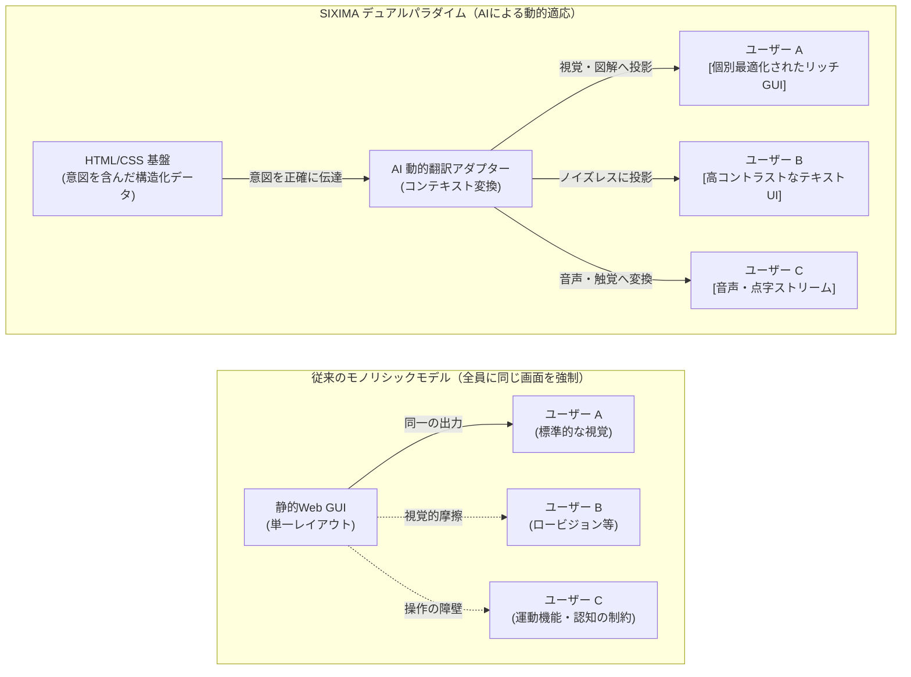
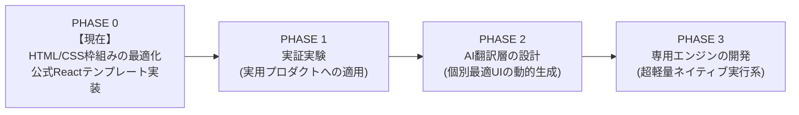

# SIXIMA

> **デュアルパラダイム・インターフェース・アーキテクチャ： ユニバーサルなアクセシビリティ × 自律型AIとの同期**

[](https://github.com/sixima/sixima)
[](https://www.jaist.ac.jp/)
[](https://github.com/sixima/sixima)
[](LICENSE)

---

## 01 / マニフェスト： デュアルパラダイムの必然性

北陸先端科学技術大学院大学（JAIST）で発足した **SIXIMA** は、次世代のインターフェース・アーキテクチャを研究・実装するオープンソース・プロジェクトです。私たちの活動は、ひとつの明確なテーゼに基づいています。

> **私たちはGUI（グラフィカル・ユーザー・インターフェース）を否定しません。視覚的な表現は、人類が生み出した最も強力な認知拡張ツールのひとつです。しかし、すべての人にとって「常に最適な単一のGUI」など存在しません。**

### 「ユニバーサルデザイン」から「AIによる個別最適化」へ
これまでWebデザインの世界では、万人が使える「ユニバーサルデザイン」を追求してきました。しかし、たった1つの画面レイアウトで全員のニーズを満たすことは不可能です。結果として、インターフェースは複雑化・肥大化し、視覚・身体・認知に多様な特性を持つ人々にとって、むしろ使いづらい「摩擦」を生み出しています。

自律型AIの発展により、**もはや全員に同じ画面を強要する必要はなくなりました。**
* 視覚情報からの認知が得意な人には、リッチな**GUI（グラフィカルなUI）**を。
* 情報の海で認知疲労を起こしやすい人には、直線的でノイズのない**テキスト（CUI）**を。
* 視覚以外のサポートが必要な人には、**音声や点字ストリーム**を。

SIXIMA は実験的な取り組みに過ぎないかもしれませんが、**「人がソフトウェアに合わせる」のではなく「ソフトウェアが人に合わせて姿を変える」**という、AI時代の新しいインターフェースの可能性を提示します。

---

### なぜ「JSON」ではなく「HTML/CSS」なのか？
単に構造化されたデータをAIに渡すだけなら、JSONのようなデータフォーマットで事足りるはずです。しかし、私たちはあえて既存の **HTML/CSS** を真実の基盤（Ground Truth）として用います。

1. **デザインの「意図」を失わないため**  
   JSONは純粋なデータですが、そこには「作者がどこを一番強調したかったのか」「どの情報をグループ化したかったのか」という**グラフィカルなデザイン意図**が含まれていません。意図が欠落したデータからAIがUIを再構築しようとすると、勝手な推測（ハルシネーション）が入り込み、情報が歪んでしまいます。
   HTMLは「情報の構造」を、CSSは「作者の視覚的な意図」を正確に伝達します。これらをそのまま用いることで、意図の伝達ミスを最小化し、GUI・CUI・音声へと正確に翻訳できるのです。

2. **既存エコシステムとの完全な互換性（ブラウザ無改造）**  
   特殊な規格や専用ブラウザを作る必要はありません。SIXIMAのデータ基盤は、現在世界中で動いている標準ブラウザエンジン（Chromium, WebKit, Gecko）のままで、一切の変更を加えることなくネイティブに動作します。開発者は新たなデータスキーマを二重管理する負担から解放されます。

3. **「後付け」ではない、設計思想としてのアクセシビリティ**  
   アクセシビリティは、開発終盤に付け足すオプション（ARIA属性の追加など）ではありません。SIXIMAでは、無駄なタグのネストを排除した平坦なDOM、予測可能なキーボード移動、極限まで高めたコントラストが、コードの1行目から「設計上の絶対制約」として組み込まれています。

---

## 02 / アーキテクチャの比較

SIXIMA は、「意味と意図の基盤データ」と「画面への投影」を完全に分離します。



---

## 03 / 開発ロードマップ

SIXIMA は4つの段階を経て進化します。現在は最初のステップである **Phase 0** を進行中です。



### 【PHASE 0】 HTML/CSS枠組みの最適化 ＆ Reactテンプレート（現在）

* **目的:** AIエージェントが誤読せず、同時に人間にとっても極めてノイズの少ないHTML/CSSの構造的ルールを確立します。
* **具体的ゴール:** これらのルールを適用した `sixima-ui` Reactテンプレートを作成すること。
* **参照実装:** **SIXIMAの公式サイトそのものを、このUI/UXのサンプル実装として構築し、公開します。**

### 【PHASE 1】 応用UXの現場検証

* **目的:** ネットワーク帯域やハードウェア制約の厳しい現実の環境下で、このアーキテクチャが「素早い意思決定」を支えられるかを検証します。
* **具体的ゴール:** 公共交通機関の運行クライアント（`JAIBUS-app` など）の実運用を通じて、キーボード完結操作や支援技術との同期をテストします。

### 【PHASE 2】 AI翻訳・動的適応層の設計

* **目的:** それぞれの利用者が抱える困難に適応し、UI/UXを動的に再構成するAIシステムを構築します。
* **具体的ゴール:** SIXIMAの基盤データから、ハルシネーションを起こすことなく「GUI」「テキスト」「音声」を生成し分けるアダプターモジュールを実装します。

### 【PHASE 3】 ブラウザ専用エンジンの開発

* **目的:** 巨大で重い既存ブラウザエンジン（Chromium / WebKit）の枠組みを越えた、超軽量な実行環境を模索します。
* **具体的ゴール:** トークンのシリアライズと支援機器との連携に特化した、SIXIMAネイティブの独立ブラウザエンジンを研究開発します。

---

## 04 / よくある質問 (FAQ)

**Q1: Webの世界を昔の「黒い画面（CUI）」に戻したいのですか？**

いいえ、違います。SIXIMAが現在提供しているターミナル風のUIは、あくまで「最も情報密度が高く、曖昧さのない基盤データ」を可視化した参照実装にすぎません。最終的な目標は、この基盤をもとにAIが「グラフィカルなGUI」や「音声」など、その人に最も適した形へ自由に変換できるようにすることです。

**Q2: 既存のWebブラウザで動きますか？**

完全に動作します。SIXIMAは新しいプロトコルや特殊な言語を発明しているわけではなく、標準的なWeb技術（セマンティックなHTMLとCSS）の「使い方」を洗練させているだけです。現在お使いのChrome、Safari、Firefox等でそのまま動作します。

---

## 05 / リポジトリ構成と使い方

```
sixima/
├── packages/
│   ├── sixima-core/          # コア仕様、トークンパーサー、DOM規約
│   ├── sixima-ui/            # ゼロ依存 React & CSS ターミナルコンポーネント
│   └── sixima-tokens/        # 等幅メトリクス & 燐光パレット定義
├── apps/
│   ├── official-portal/      # SIXIMA 公式サイト (Phase 0 のサンプル実装)
│   └── jaibus-app/           # 高密度交通運行クライアント (Phase 1 検証用)
└── docs/                     # 仕様書、ホワイトペーパー、監査記録

```

### 開発の始め方

```bash
# 1. リポジトリをクローン
git clone [https://github.com/sixima/sixima.git](https://github.com/sixima/sixima.git)
cd sixima

# 2. パッケージのインストール (Node.js 18+ 推奨)
npm install

# 3. 開発サーバーの起動
npm run dev

```

---

## 06 / プロジェクトへの参加

SIXIMA は現在 Phase 0 の実験段階にあり、ソフトウェアエンジニア、デザイナー、アクセシビリティ研究者、AI開発者の皆様からのフィードバックとコントリビューションを歓迎しています。

* **GitHub Issues:** [github.com/sixima/sixima/issues](https://www.google.com/search?q=https://github.com/sixima/sixima/issues)
* **Email:** [sixima@proton.me](https://www.google.com/search?q=mailto%3Asixima%40proton.me)
* **Origin:** 北陸先端科学技術大学院大学（JAIST）, 石川県能美市

---

## 07 / ライセンス

本プロジェクトは [MIT License](https://www.google.com/search?q=LICENSE) のもとで公開されています。
