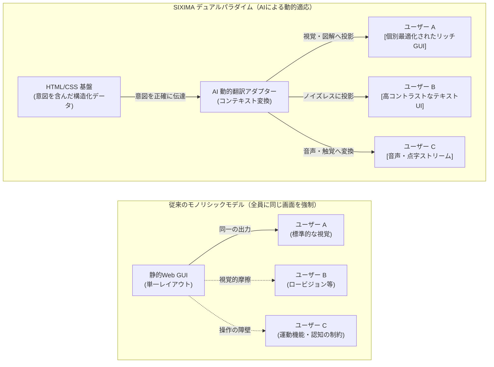
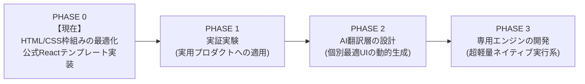

# SIXIMA

> **デュアルパラダイム・インターフェース・アーキテクチャ： ユニバーサルなアクセシビリティ × 自律型AIとの同期**

[](https://github.com/sixima/sixima)
[](https://www.jaist.ac.jp/)
[](https://github.com/sixima/sixima)
[](LICENSE)

---

## 01 / ビジョン： 私たちが目指すインターフェースの未来

北陸先端科学技術大学院大学（JAIST）で発足した **SIXIMA** は、オープンソースのUI/UX研究プロジェクトです。私たちが目指しているのは「1つのWebサイトが、見る人によって全く異なる最適な姿へリアルタイムに変化する世界」です。

想像してみてください。同じシステムにアクセスしても、
* 視覚的な情報処理が得意な **ユーザーA** には、リッチでグラフィカルな画面（GUI）が表示される。
* 情報過多で認知疲労を起こしやすい **ユーザーB** には、ノイズを排したシンプルなテキスト画面（CUI）が表示される。
* 視覚に頼らない **ユーザーC** には、完璧に構造化された音声や点字ストリームとして提供される。

これを開発者が個別に作るのではなく、**AIが中継して自動的に変換（翻訳）する仕組み**。これが私たちの提唱する「デュアルパラダイム（2層構造）」のビジョンです。

---

## 02 / なぜ必要なのか？： 「1つの画面」の限界

私たちはGUI（グラフィカル・ユーザー・インターフェース）の価値を否定しません。視覚的な表現は、人間の認知を広げる素晴らしい発明です。

しかし、これまでWebデザインが追い求めてきた「万人が使えるユニバーサルデザイン（＝たった1つの画面レイアウトで全員のニーズを満たそうとする試み）」は限界を迎えています。

視力、運動機能、認知特性は人それぞれです。すべての人に「同じ画面」を強要することは、結果として無数の妥協を生み、インターフェースを複雑に肥大化させ、多くの人に「使いづらさ」や「情報過多による疲労」という摩擦を強いています。

自律型AIが発達した今、**もう全員に「同じ画面」を押し付ける必要はありません。人がソフトウェアの画面に合わせるのではなく、ソフトウェア側が人に合わせて姿を変えればよいのです。**

---

## 03 / どうやって作るのか？： HTML/CSSの再定義

このビジョンを実現するためには、AIがサイトの情報を「完璧に誤読なく」読み取れる基盤が必要です。

単にデータをAIに渡すだけなら、JSONのようなデータフォーマットで事足りると思うかもしれません。しかし、私たちはあえて既存の **HTML/CSS** を基盤（Ground Truth）として用います。

1. **デザインの「意図」を失わないため**  
   JSONは純粋なデータですが、そこには「作者がどこを一番強調したかったのか」「どの情報をグループ化したかったのか」という**グラフィカルなデザイン意図**が含まれていません。意図が欠落したデータからAIがUIを再構築しようとすると、勝手な推測（ハルシネーション）が入り込み、情報が歪んでしまいます。
   **HTMLは「情報の構造」を、CSSは「作者の視覚的な意図」を伝達します。** これらをそのまま用いることで、意図の伝達ミスを最小化し、GUI・テキスト・音声へと正確に翻訳できるのです。

2. **専用ブラウザ不要（既存エコシステムとの完全互換）**  
   特殊な規格や専用の実行環境を作る必要はありません。SIXIMAのデータ基盤は、現在世界中で動いている標準ブラウザ（Chrome, Safari, Firefox）のままで、一切の変更を加えることなくネイティブに動作します。開発者も新しいデータスキーマを二重管理する必要がありません。

3. **設計思想としてのアクセシビリティ**  
   アクセシビリティは、開発の最後に付け足すオプション（後付けのARIA属性など）ではありません。無駄なタグのネストを排除した平坦なDOM、予測可能なキーボード移動といったルールが、コードの1行目から「絶対の制約」として組み込まれています。

---

## 04 / デュアルパラダイム・アーキテクチャ

以上の設計により、「意味と意図の基盤データ」と「画面への動的な投影」を分離します。



---

## 05 / 開発ロードマップと現在地

SIXIMA は4つの段階を経て進化します。現在は最初のステップである **Phase 0** を進行中です。



### 【PHASE 0】 HTML/CSS枠組みの最適化 ＆ Reactテンプレート（現在進行中）

* **目的:** AIエージェントが誤読せず、同時に人間にとっても極めてノイズの少ない、基盤となるHTML/CSSの構造的ルールを確立します。
* **具体的ゴール:** これらのルールを適用した `sixima-ui` Reactテンプレートを作成すること。
* **参照実装:** **私たちが公開しているターミナル風のSIXIMA公式サイトそのものが、この「最も情報密度が高く、曖昧さのない基盤データ」のサンプル実装です。**

### 【PHASE 1】 応用UXの現場検証

* **目的:** ネットワーク帯域やハードウェア制約の厳しい現実の環境下で、このアーキテクチャが「素早い意思決定」を支えられるかを検証します。
* **具体的ゴール:** 公共交通機関の運行クライアント（`JAIBUS-app` など）の実運用を通じて、キーボード完結操作や支援技術との同期をテストします。

### 【PHASE 2】 AI翻訳・動的適応層の設計

* **目的:** それぞれの利用者が抱える困難に適応し、UI/UXを動的に再構成するAIシステムを構築します。
* **具体的ゴール:** SIXIMAの基盤データから、ハルシネーションを起こすことなく「リッチGUI」「テキスト」「音声」を生成し分けるアダプターモジュールを実装します。

### 【PHASE 3】 ブラウザ専用エンジンの開発

* **目的:** 巨大で重い既存ブラウザエンジン（Chromium / WebKit）の枠組みを越えた、超軽量な実行環境を模索します。
* **具体的ゴール:** トークンのシリアライズと支援機器との連携に特化した、SIXIMAネイティブの独立ブラウザエンジンを研究開発します。

---

## 06 / リポジトリ構成と使い方

```
sixima/
├── packages/
│   ├── sixima-core/          # コア仕様、トークンパーサー、DOM規約
│   ├── sixima-ui/            # ゼロ依存 React & CSS ターミナルコンポーネント
│   └── sixima-tokens/        # 等幅メトリクス & 燐光パレット定義
├── apps/
│   ├── official-portal/      # SIXIMA 公式サイト (Phase 0 のサンプル実装)
│   └── jaibus-app/           # 高密度交通運行クライアント (Phase 1 検証用)
└── docs/                     # 仕様書、ホワイトペーパー、監査記録

```

### 開発の始め方

```bash
# 1. リポジトリをクローン
git clone [https://github.com/sixima/sixima.git](https://github.com/sixima/sixima.git)
cd sixima

# 2. パッケージのインストール (Node.js 18+ 推奨)
npm install

# 3. 開発サーバーの起動
npm run dev

```

---

## 07 / プロジェクトへの参加

SIXIMA は現在 Phase 0 の実験段階にあり、ソフトウェアエンジニア、デザイナー、アクセシビリティ研究者、AI開発者の皆様からのフィードバックとコントリビューションを歓迎しています。

* **GitHub Issues:** [github.com/sixima-electric/sixima/issues](https://www.google.com/search?q=https://github.com/sixima/sixima/issues)
* **Email:** [sixima@proton.me](https://www.google.com/search?q=mailto%3Asixima%40proton.me)
* **Origin:** 北陸先端科学技術大学院大学（JAIST）, 石川県能美市

## 08 / SIXIMAの由来とミッション

**SIXIMA（シキシマ）** という名称は、日本の古称・雅称である「敷島（しきしま）」をルーツとしています。「敷き広げられた島々（大地）」を意味するこの言葉には、私たちが掲げる最も重要なミッションが込められています。

> **「誰一人取り残さない、普遍的なデジタル基盤を敷き広げる」**

現代のWebは豊かになった一方で、「万人に1つの画面（GUI）」を強要することで、視覚・身体・認知に多様な特性を持つ多くの人々をデジタルの恩恵から取り残してきました。人がソフトウェアの枠組みに無理をして合わせる時代は、もう終わらせなければなりません。

私たちが構築しようとしているのは、あらゆる分断を埋め、すべての人が最も自分に合った形（リッチな画面、シンプルなテキスト、音声、点字）で情報にアクセスできる「強固で普遍的なインターフェースの基盤（大地）」です。

また、この6文字（S-I-X-I-M-A）には、私たちのアーキテクチャを構成する技術的なテーゼがエンコードされています。

* **S**emantic（意味論的な構造基盤）
* **I**nterface（インターフェース）
* **X** [ Cross ]（感覚や境界の交差・超越）
* **I**ntelligent（知能 / AIエージェント）
* **M**achine（機械）
* **A**daptation（動的適応）

SIXIMA は、古き良き「敷島」のように揺るぎないHTML/CSSの構造的基盤（Ground Truth）でありながら、AIの知能（Intelligent Machine）と交差（X）することで、誰一人取り残すことなくあらゆる姿へと適応（Adaptation）する、新しいインターフェースの土台なのです。

---

## 08 / ライセンス

本プロジェクトは [MIT License](https://www.google.com/search?q=LICENSE) のもとで公開されています。
