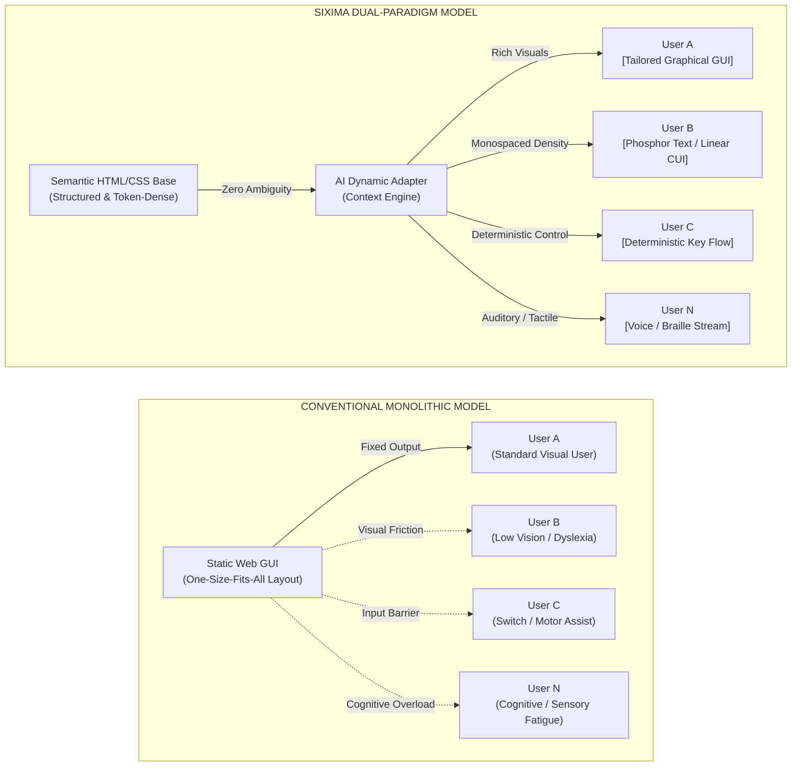
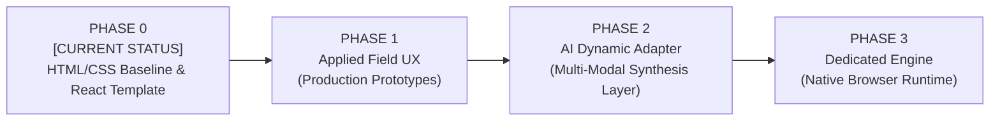

# SIXIMA


> **Dual-Paradigm Interface Architecture: Universal Human Accessibility × Autonomous Agent Synchronization.**

[](https://github.com/sixima/sixima)
[](https://www.jaist.ac.jp/)
[](https://github.com/sixima/sixima)
[](LICENSE)

---

## 01 / Manifest: The Dual-Paradigm Imperative

Established at the **Japan Advanced Institute of Science and Technology (JAIST)**, **SIXIMA** is an open-source research collective and interface initiative. We operate under a pragmatic thesis:

> **We do not reject the Graphical User Interface (GUI). Visual computing remains one of humanity's greatest cognitive amplifiers. However, no single, static GUI can ever be optimal for all human beings.**

### From Static Universal Design to Individualized Optimization via AI
For decades, interface design has pursued "Universal Design"—attempting to craft a single, compromises-laden graphical layout that serves everyone. In practice, this forced compromise results in interfaces bloated with visual noise, non-semantic wrappers, and rigid interaction assumptions that create friction for individuals with sensory, motor, or cognitive differences.

With the advent of autonomous AI and dynamic synthesis, **we no longer need to force all users into the same visual mold.**
* **For those who thrive on visual cognition:** High-density, rich graphical projections and charts.
* **For those who require minimal cognitive fatigue or linear focus:** High-contrast, deterministic text-first interfaces.
* **For non-visual or tactile navigation:** Direct auditory synthesis and refreshable Braille streams.

SIXIMA is an experimental initiative, but its purpose is concrete: to demonstrate a realistic path forward where software dynamically conforms to the human, rather than forcing the human to conform to the software.

### The Realistic Foundations: Semantic HTML, Standard Browsers, Built-in Inclusion

1. **HTML/CSS Has Sufficient Structural Redundancy:**  
   Standard, semantic HTML/CSS already contains all necessary relational and structural data required to reconstruct any interface mode—whether a rich GUI, a dense terminal CUI, or a sequential speech tree. We do not need to invent proprietary JSON serialization schemas or complex metadata sidecars. The semantic web itself is our data layer.

2. **Zero Browser Engine Modifications:**  
   SIXIMA does not require experimental browser builds, custom WebAssembly runtimes, or modified rendering forks. It is engineered to run **100% natively on standard, unmodified browser engines (Chromium, WebKit, Gecko)** using production web standards today.

3. **Accessibility as Core Architecture, Not an Afterthought:**  
   Accessibility is not an ARIA patch applied at the end of a sprint. In SIXIMA, flat DOM hierarchies, phosphor-grade luminance contrast, predictable keyboard focus loops, and unambiguous state transitions are foundational architectural constraints that govern every line of code from day zero.

---

## 02 / The Dual-Paradigm Architecture

SIXIMA cleanly decouples **semantic ground truth** from **ephemeral projection**. A clean, deterministic markup base serves as the unambiguous input for real-time individualized interface synthesis:



1. **Semantic Ground Truth:** Applications are constructed with strictly structured, token-dense HTML/CSS without bloated decorative wrappers.
2. **AI Dynamic Adaptation:** Machine agents ingest this deterministic tree without hallucination and project the ideal modality tailored to the specific user's physical, sensory, or operational environment.

---

## 03 / Core Directives

### Universal Multi-Sensory Inclusion (Built-in by Design)

* **Visual Inclusivity:** High-contrast phosphor luminescence, 1px coordinate boundaries, and monospaced proportions ensure legibility without ocular fatigue.
* **Non-Visual & Tactile Parity:** Flat DOM trees traversed effortlessly by screen readers and refreshable Braille displays with 0% structural debris.
* **Cognitive Velocity:** Strict predictability, zero unexpected layout shifts, and no intrusive decorative noise to minimize mental fatigue.

### Agentic Token Optimization

* **Context-Window Efficiency:** Eliminating arbitrary wrapper nests reduces DOM token consumption by up to 70% during autonomous agent parsing.
* **Deterministic Execution:** Clear semantic tags ensure synthetic agents can locate, interact with, and verify UI elements reliably.

### Applied UX Beyond Pure UI

* Ergonomics encompass the entire interactive envelope: sub-millisecond input responsiveness, battery consumption, and mental processing speed.
* Demonstrated through production clients such as **`JAIBUS-app`** (a high-density transit scheduling tool).

---

## 04 / Philosophical Discourse & Inquiries

### Q1: Are you trying to eliminate graphical UIs and replace the web with terminal text?

**Position:** Absolutely not. Graphical user interfaces are invaluable for spatial reasoning, visual design, and rapid visual scanning. However, forcing *only* a graphical interface upon everyone excludes those who process information differently. We use a deterministic, text-first reference implementation because text is the highest-density, most unambiguous bridge between human and machine comprehension—from which any GUI or audio stream can be accurately derived.

### Q2: Why rely on standard HTML/CSS instead of custom JSON protocols?

**Position:** HTML/CSS is already a resilient, battle-tested standard with mature semantic hierarchies (`<main>`, `<nav>`, `<article>`, `<table>`, `<button>`). Adding proprietary JSON abstraction layers creates ecosystem lock-in and fractures assistive hardware compatibility. By utilizing semantic HTML/CSS properly, we achieve immediate compatibility with every existing browser, assistive reader, and LLM parser out of the box.

### Q3: How does this run on existing browsers today?

**Position:** SIXIMA requires zero proprietary browser forks. By adhering strictly to core Web Standards, CSS Custom Properties, and clean semantic elements, SIXIMA applications render with near-zero runtime overhead directly in modern browsers while maintaining native keyboard and screen reader hooks.

---

## 05 / Strategic Roadmap

SIXIMA progresses across four disciplined development phases. We are currently operating in **Phase 0**.



### [PHASE 0: HTML/CSS FRAMEWORK OPTIMIZATION & REACT TEMPLATE] — CURRENT ACTIVE PHASE

* **Objective:** Radical optimization of HTML/CSS structural patterns, monotonic layouts, and token-dense DOM semantics on standard browser engines.
* **Milestone:** Build and release the standardized `sixima-ui` React template.
* **Reference Implementation:** The official SIXIMA portal itself serves as the live, open-source demonstration and operational testbed of this UI/UX architecture.

### [PHASE 1: APPLIED FIELD UX & STRESS TESTING]

* **Objective:** Validate ergonomic interaction models across real-world, high-frequency utility scenarios.
* **Milestone:** Deploy operational clients (such as `JAIBUS-app`) to refine zero-latency key navigation, assistive device flow, and network-constrained performance.

### [PHASE 2: AI DYNAMIC ADAPTATION & TRANSLATION LAYER]

* **Objective:** Design the multi-modal AI mediation pipeline.
* **Milestone:** Build dynamic synthesis modules that ingest clean SIXIMA semantic markup and reconstruct customized, optimal UI/UX formats (rich GUI diagrams, high-contrast text views, speech streams, or simplified language) calibrated to individual needs.

### [PHASE 3: DEDICATED SIXIMA BROWSER RUNTIME ENGINE]

* **Objective:** Long-term exploration beyond standard browser overhead.
* **Milestone:** Prototype a dedicated, ultra-lightweight browser engine optimized specifically for token serialization, zero layout thrashing, and instant native assistive-device synchronization.

---

## 06 / Repository Ecosystem

```
sixima/
├── packages/
│   ├── sixima-core/          # Core specifications, token parsers & DOM contracts
│   ├── sixima-ui/            # Zero-dependency React & CSS terminal primitives
│   └── sixima-tokens/        # Monospace metrics & phosphor luminance palette
├── apps/
│   ├── official-portal/      # The SIXIMA live reference platform
│   └── jaibus-app/           # Applied high-density transit client
├── benchmarks/               # Token consumption & assistive test suites
└── docs/                     # Specifications, whitepapers & accessibility audits

```

---

## 07 / Getting Started

### Prerequisites

* Node.js `>= 18.0.0`
* npm / pnpm / yarn

### Installation & Local Setup

```bash
# Clone the repository
git clone [https://github.com/sixima/sixima.git](https://github.com/sixima/sixima.git)
cd sixima

# Install dependencies
npm install

# Launch local development environment
npm run dev

```

---

## 08 / Open Invitation & Contribution Protocols

SIXIMA is an evolving research experiment. We actively invite software engineers, accessibility researchers, designers, and AI practitioners to collaborate:

* **Accessibility Auditing:** Benchmark components with screen readers, switch inputs, eye-tracking hardware, and refreshable Braille displays.
* **Component Engineering:** Expand `sixima-ui` primitives, optimize CSS rendering, and build real-world client applications.
* **Agent Benchmarking:** Measure token efficiency, execution accuracy, and parsing throughput with LLM agent pipelines.

### Contribution Flow

1. Fork the repository.
2. Create your feature branch (`git checkout -b feature/semantic-matrix`).
3. Commit your changes (`git commit -m 'feat: implement semantic matrix layout'`).
4. Push to the branch (`git push origin feature/semantic-matrix`).
5. Open a Pull Request.

---

## 09 / Communication & Endpoints

* **GitHub Issues:** [github.com/sixima/sixima/issues](https://www.google.com/search?q=https://github.com/sixima/sixima/issues)
* **Direct Transmission:** [sixima@proton.me](https://www.google.com/search?q=mailto%3Asixima%40proton.me)
* **Research Station:** Japan Advanced Institute of Science and Technology (JAIST), Ishikawa, Japan

---

## 10 / License

Distributed under the MIT License. See [`LICENSE`](https://www.google.com/search?q=LICENSE) for complete details.

```
