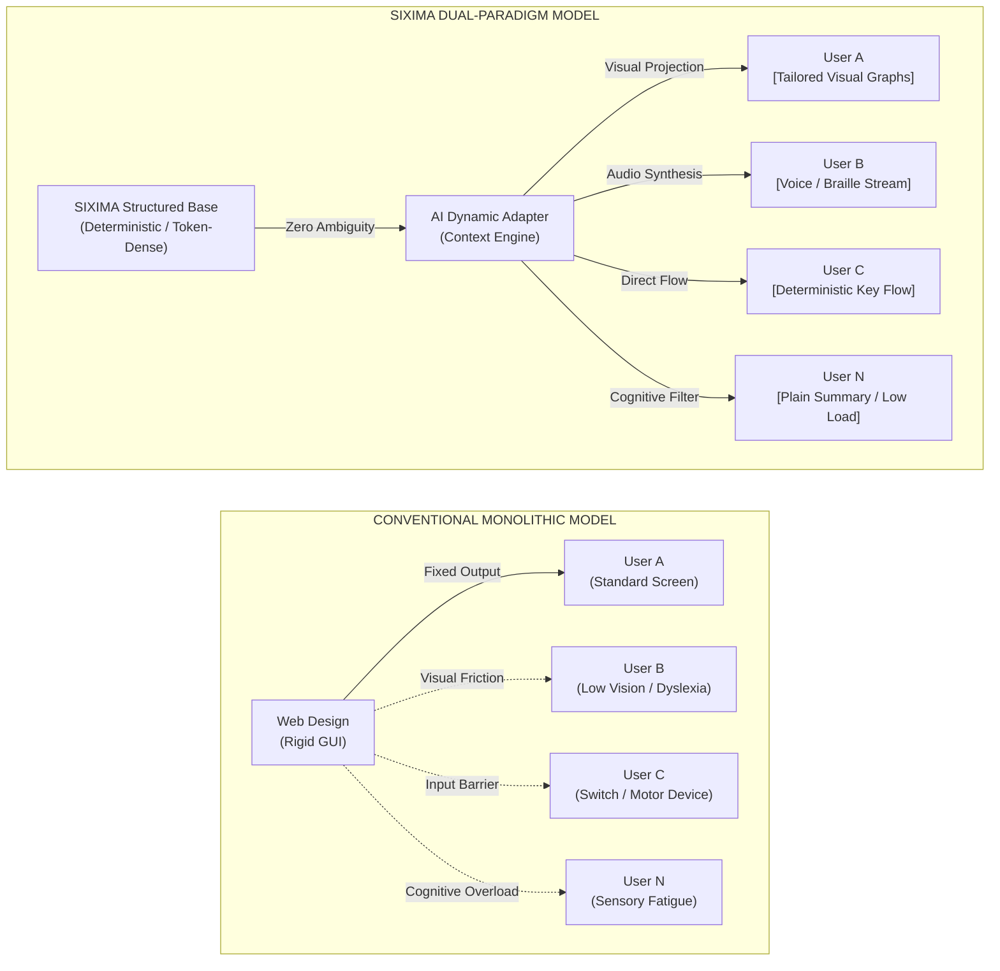

# SIXIMA


> **Dual-Paradigm Interface Architecture: Universal Human Accessibility × Autonomous Agent Synchronization.**

[](https://github.com/sixima/sixima)
[](https://www.jaist.ac.jp/)
[](LICENSE)

---

## 01 / Overview

Originated at the **Japan Advanced Institute of Science and Technology (JAIST)**, **SIXIMA** is an open-source interface collective and research initiative. 

We construct software under a single directive: **the web is no longer a human-only domain, but a shared operational environment for both human visual cognition and autonomous AI agents.**

Contemporary graphical user interfaces (GUIs) have accumulated excessive animation layers, complex nested wrappers, and non-semantic DOM trees. This creates visual and cognitive friction for individuals navigating diverse sensory or physical conditions, while introducing severe parsing errors and token inefficiencies for autonomous LLM agents.

SIXIMA establishes a **deterministic, token-dense, and accessible interface standard** designed to eliminate semantic friction entirely.

---

## 02 / The Dual-Paradigm Architecture

Instead of imposing a single, rigid visual interface on every user, SIXIMA decouples the semantic data layer from dynamic rendering.



1. **Deterministic Truth Layer:** Raw data is structured as flat, token-dense, key-value markup with 0% ambiguity.
2. **AI-Driven Dynamic Adaptation:** Autonomous synthetic agents read the base layer with zero hallucination and project personalized interfaces (visual graphs, speech streams, high-contrast layouts, or plain language) tailored to the individual.

---

## 03 / Core Directives

### Universal Multi-Sensory Accessibility
* **Visual Ergonomics:** Phosphor-grade contrast ratios, strict 1px coordinate boundaries, and monospaced typography designed to eliminate eye strain and low-vision ambiguity.
* **Non-Visual & Tactile Parity:** Flat DOM hierarchy readable by screen readers and Braille displays without structural noise. Deterministic keyboard and single-switch navigation parity.
* **Cognitive Low-Load:** Elimination of unexpected layout shifts, dark patterns, and decorative bloat to reduce sensory fatigue for neurodivergent individuals.

### Agentic Token Optimization
* **Sub-linear Parsing Overhead:** Minimizes DOM depth and removes decorative wrappers, cutting LLM context consumption by up to 70%.
* **Machine Determinism:** Unambiguous interactive primitives designed for autonomous agent execution and verification.

### Applied UX Beyond UI
* Interface design is treated as a complete ergonomic discipline. We apply these standards to real-world operational tools such as **`JAIBUS-app`** (a high-density transit client) to demonstrate rapid decision-making across varied hardware and network constraints.

---

## 04 / Repository Ecosystem

| Component | Path | Description |
| :--- | :--- | :--- |
| **`sixima-core`** | `/packages/core` | Base specification, token serialization formats, and accessibility contracts. |
| **`sixima-ui`** | `/packages/ui` | Zero-dependency terminal component primitives (React / Web Components / CSS). |
| **`jaibus-app`** | `/apps/jaibus` | Production transit client implementing full SIXIMA UX ergonomics. |
| **`benchmarks`** | `/benchmarks` | LLM token consumption and accessibility test suites. |

---

## 05 / Getting Started

### Prerequisites
* Node.js `>= 18.0.0`
* npm / pnpm / yarn

### Installation
```bash
# Clone the repository
git clone [https://github.com/sixima/sixima.git](https://github.com/sixima/sixima.git)
cd sixima


# Install dependencies
npm install

# Start local development environment
npm run dev
```


## 06 / Project Status & Open Invitation

SIXIMA is in continuous, active evolution. Our token parsers, component contracts, and UX workflows are constantly tested, critiqued, and refined.

We actively invite contributions across all domains:

  Accessibility Auditing: Test component behavior against screen readers, switch-access inputs, and assistive hardware.

  Component & Systems Engineering: Expand sixima-ui primitives, optimize CSS terminal renderers, and build real-world client applications.

  Agent Benchmarking: Measure token efficiency, execution accuracy, and parsing throughput with LLM agent pipelines.

### Contribution Flow

  Fork the repository.

  Create your feature branch (git checkout -b feature/accessible-matrix).

  Commit your changes (git commit -m 'feat: add high-density matrix component').

  Push to the branch (git push origin feature/accessible-matrix).

    Open a Pull Request.
## 07 / Communication & Endpoints

  GitHub Issues: github.com/sixima/sixima/issues

  Direct Transmission: sixima@proton.me

  Research Node: Japan Advanced Institute of Science and Technology (JAIST), Ishikawa, Japan

## 08 / License

Distributed under the MIT License. See LICENSE for complete details.
