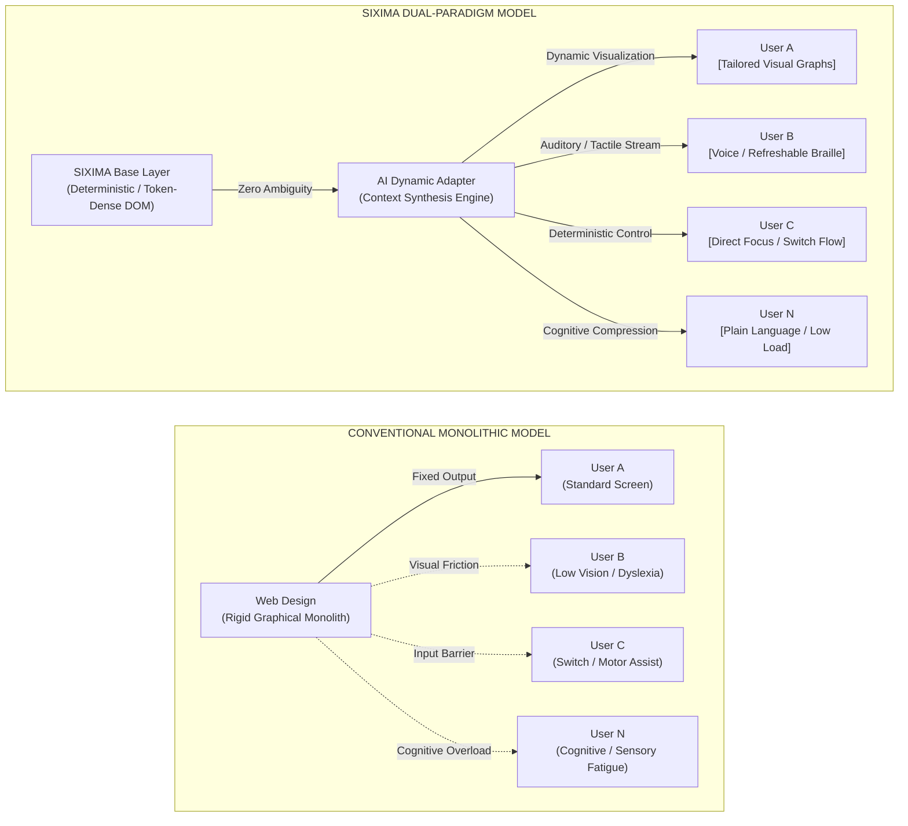
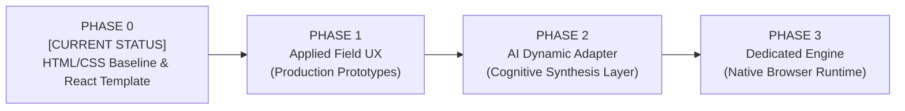

# SIXIMA


> **Dual-Paradigm Interface Architecture: Universal Human Accessibility × Autonomous Agent Synchronization.**

[](https://github.com/sixima/sixima)
[](https://www.jaist.ac.jp/)
[](https://github.com/sixima/sixima)
[](LICENSE)

---

## 01 / Manifest: The Dual-Paradigm Imperative

Established at the **Japan Advanced Institute of Science and Technology (JAIST)**, **SIXIMA** is an open-source research collective and system architecture initiative. We operate under a single, uncompromising thesis:

> **The digital interface is no longer a human-exclusive sensory surface; it is a shared operational runtime between human cognition and autonomous artificial intelligence.**

### The Breakdown of Legacy Web Architecture
For over three decades, graphical user interfaces (GUIs) have evolved under the presumption of biological visual monopoly. The modern web has accumulated catastrophic structural debt:
* **Sensory & Cognitive Exclusion:** Heavy client-side bundles, dynamic layout thrashing, low-contrast palettes, and opaque hover-only interactions penalize users with visual, motor, auditory, and neurodivergent differences.
* **Synthetic Parsing Opacity:** Deeply nested, non-semantic DOM trees and decorative wrapper bloat force Large Language Models (LLMs) and autonomous agents into fragile, expensive visual scraping routines, driving token inflation and high hallucination rates.

SIXIMA rejects decorative excess in favor of **Functional Sovereignty**. We build a deterministic, key-value, token-dense structural standard that provides instantaneous cognitive velocity for all human beings while offering 100% deterministic, machine-legible execution for synthetic agents.

---

## 02 / The Dual-Paradigm Architecture

SIXIMA fundamentally decouples **semantic ground truth** from **ephemeral visual projection**. 

We do not believe in a rigid, one-size-fits-all graphical interface. Instead, a clean, unambiguous base layer enables AI to synthesize bespoke, real-time interfaces calibrated to individual human constraints:



1. **Deterministic Truth Layer:** Core application state and information exist strictly as flat, token-dense, key-value markup with zero structural ambiguity.
2. **AI Dynamic Adaptation Layer:** Autonomous models read this deterministic stream with zero hallucination, instantly projecting the precise interface paradigm (tactile Braille, synthesized speech, high-contrast visual models, or simplified text) required by the individual.

---

## 03 / Core Architectural Directives

### Universal Multi-Sensory Accessibility

* **Visual Inclusivity:** Strict 1px coordinate boundaries, monospaced typography, and high-luminance phosphor contrast eliminate visual noise, eye fatigue, and low-contrast ambiguity for low-vision users.
* **Non-Visual & Tactile Parity:** Flat DOM hierarchy readable by screen readers and refreshable Braille displays without structural bloat. 100% deterministic keyboard and single-switch navigation parity.
* **Cognitive Load Reduction:** Absolute elimination of layout shifts, unexpected popovers, and decorative motion, reducing anxiety and sensory overload for neurodivergent individuals.

### Agentic Token Optimization

* **Context-Window Density:** Radical reduction of DOM depth minimizes token consumption by up to 70% during autonomous agent traversal.
* **Deterministic Action Surfaces:** Unambiguous interactive primitives engineered for reliable agent execution and validation.

### Applied UX Beyond Pure UI

* Interface design is not mere visual skinning; it is an end-to-end ergonomic system encompassing network latency, state management, and cognitive execution velocity.
* Real-world operational clients, such as **`JAIBUS-app`** (a high-density transit and scheduling client), actively validate our principles under live network and device constraints.

---

## 04 / Philosophical Discourse & Inquiries

### Q1: Is a text-first interface truly universally accessible for everyone?

**Position:** We do not claim that raw monospace text is the single optimal graphical format for every human eye. Users with dyslexia, visual impairments, or language barriers often require multi-modal representations.

However, **there is no single static graphical interface that fits all human diversity.**

AI is the dynamic bridge capable of real-time multi-modal adaptation (visual, auditory, tactile, simplified language). For AI to translate without hallucination, the underlying base must be **100% structured, legible, and unambiguous**. By engineering an uncompromising, token-efficient foundation, SIXIMA enables true universal inclusion.

### Q2: Is this simply retro-nostalgia or terminal cosplay?

**Position:** This is functional sovereignty, not nostalgia. Modern "rich" interfaces introduce hidden latencies, battery drain, and layout shifts that disorient assistive hardware and agent parsers. Monospaced terminal ergonomics maximize information density, provide predictable focus loops, and guarantee instant execution velocity across both high-end workstations and low-power legacy hardware.

### Q3: Does SIXIMA discard complex data visualizations and spatial models?

**Position:** We decouple *semantic truth* from *ephemeral visualization*. Visual charts are often inaccessible "black boxes." In SIXIMA, data is preserved as transparent, structured matrices first. Graphical charts, diagrams, and maps exist strictly as optional, deterministic projection layers on top of clean data—never as replacements for it.

### Q4: Is a terminal environment too intimidating for casual users?

**Position:** Unpredictable user experiences with deceptive patterns and hidden navigation cause far more anxiety than structured simplicity. When every interaction target is deterministic and explicitly focused, users develop rapid cognitive mastery. Furthermore, as AI agents increasingly handle routine operational execution, structured UI serves as the safest, most transparent verification surface.

---

## 05 / Strategic Roadmap

SIXIMA is structured across four disciplined development phases. We are currently deployed in **Phase 0**.



### [PHASE 0: FOUNDATIONAL OPTIMIZATION & REACT TEMPLATE] — CURRENT ACTIVE PHASE

* **Objective:** Radical optimization of HTML/CSS semantic markup, monotonic layouts, and token-dense DOM hierarchy.
* **Core Deliverable:** Establish the official `sixima-ui` component specification and React starter template.
* **Reference Implementation:** The official SIXIMA portal itself serves as the live, open-source demonstration and operational testbed of this UI/UX architecture.

### [PHASE 1: APPLIED FIELD UX & STRESS TESTING]

* **Objective:** Validate SIXIMA ergonomics across high-frequency utility scenarios under severe hardware, device, and network constraints.
* **Core Deliverable:** Deploy production-grade domain applications (such as `JAIBUS-app`) to refine zero-latency key navigation and real-world accessibility flows.

### [PHASE 2: AI DYNAMIC ADAPTATION & TRANSLATION LAYER]

* **Objective:** Design and deploy the real-time AI mediation architecture.
* **Core Deliverable:** Construct autonomous agent pipelines that ingest clean SIXIMA base markup and dynamically reconstruct customized UI/UX formats (speech streams, tactile signals, visual diagrams, or simplified text) tailored to each user's unique cognitive profile.

### [PHASE 3: DEDICATED SIXIMA BROWSER RUNTIME ENGINE]

* **Objective:** Break free from legacy browser rendering engines (Chromium/WebKit bloat).
* **Core Deliverable:** Develop an independent, lightweight browser engine built natively for deterministic token serialization, zero layout thrashing, and instantaneous assistive-device synchronization.

---

## 06 / Repository Ecosystem

```
sixima/
├── packages/
│   ├── sixima-core/          # Core specifications, token parsers & DOM contracts
│   ├── sixima-ui/            # Zero-dependency React & CSS terminal primitives
│   └── sixima-tokens/        # Monospace metrics & phosphor luminance palette
├── apps/
│   ├── official-portal/      # The SIXIMA live reference platform
│   └── jaibus-app/           # Applied high-density transit client
├── benchmarks/               # Token consumption & assistive test suites
└── docs/                     # Specifications, whitepapers & accessibility audits

```

---

## 07 / Getting Started

### Prerequisites

* Node.js `>= 18.0.0`
* npm / pnpm / yarn

### Installation & Local Setup

```bash
# Clone the repository
git clone [https://github.com/sixima/sixima.git](https://github.com/sixima/sixima.git)
cd sixima

# Install dependencies
npm install

# Launch local development environment
npm run dev

```

---

## 08 / Open Invitation & Contribution Protocols

SIXIMA is in continuous, active evolution. Our token parsers, accessibility patterns, component specifications, and UX workflows are constantly tested, challenged, and rewritten.

Building an interface standard that accommodates every human cognitive profile while establishing seamless symbiosis with synthetic intelligence cannot happen in isolation. **We need your critique, your perspectives, and your code.**

### Contribution Areas

* **Accessibility Auditing:** Audit components with screen readers, refreshable Braille displays, switch-access inputs, and eye-tracking systems.
* **Core & Systems Engineering:** Expand `sixima-ui` component primitives, optimize CSS terminal renderers, and build lightweight application ports.
* **Agent Protocol Benchmarking:** Design test suites measuring LLM token efficiency, execution accuracy, and machine-parsing speed.

### Workflow

1. Fork the repository.
2. Create your feature branch (`git checkout -b feature/accessible-token-parser`).
3. Commit your changes (`git commit -m 'feat: implement token-dense matrix component'`).
4. Push to the branch (`git push origin feature/accessible-token-parser`).
5. Open a Pull Request.

---

## 09 / Communication & Endpoints

* **GitHub Issues:** [github.com/sixima/sixima/issues](https://www.google.com/search?q=https://github.com/sixima/sixima/issues)
* **Direct Transmission:** [sixima@proton.me](https://www.google.com/search?q=mailto%3Asixima%40proton.me)
* **Research Station:** Japan Advanced Institute of Science and Technology (JAIST), Ishikawa, Japan

---

## 10 / License

Distributed under the MIT License. See [`LICENSE`](https://www.google.com/search?q=LICENSE) for complete details.

```
