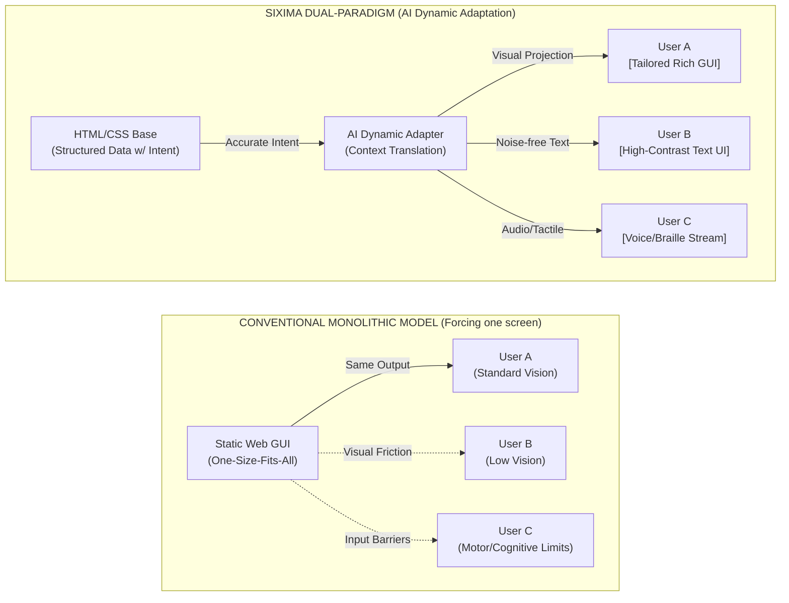
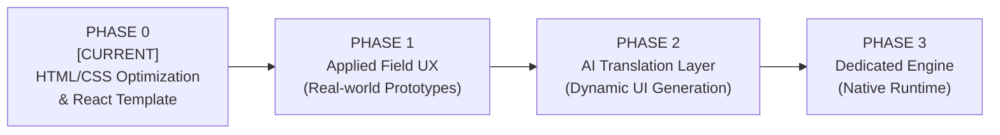

# SIXIMA
［project website is here](https://sixima-electric.github.io/sixima/) 
> **Dual-Paradigm Interface Architecture: Universal Accessibility × Autonomous AI Synchronization.**
> 
> *🌐 [日本語のREADME (README-jp.md) はこちら](README-jp.md)*


[](https://github.com/sixima/sixima)
[](https://www.jaist.ac.jp/)
[](https://github.com/sixima/sixima)
[](LICENSE)

---

## 01 / Vision: The Future of Interfaces We Envision

Originated at the **Japan Advanced Institute of Science and Technology (JAIST)**, **SIXIMA** is an open-source UI/UX research project. The future we are building is one where **a single website dynamically and in real-time transforms into entirely different, optimal forms depending on who is viewing it.**

Imagine accessing the same system, but:
* **User A**, who excels in visual processing, sees a rich, graphical interface (GUI).
* **User B**, who experiences cognitive fatigue from information overload, sees a noise-free, highly focused plain text interface (CUI).
* **User C**, who relies on non-visual navigation, receives a perfectly structured audio or refreshable Braille stream.

Instead of developers manually building these variations, **an AI acts as the intermediary to automatically translate and project them.** This is our vision of the **"Dual-Paradigm"** architecture.

---

## 02 / Why It's Necessary: The Limits of the "One-Size-Fits-All" Screen

We do not reject the Graphical User Interface (GUI). Visual computing is a brilliant invention that expands human cognition. 

However, the traditional goal of web design—"Universal Design" (attempting to satisfy everyone's needs with a single screen layout)—has reached its limits. 

Vision, motor skills, and cognitive traits vary wildly from person to person. Forcing a single screen on everyone inevitably leads to endless compromises, resulting in bloated interfaces that create friction, sensory overload, and "hard-to-use" experiences for many.

With the advent of autonomous AI, **we no longer need to force everyone into the same visual mold. Humans shouldn't have to adapt to the software's screen; the software should adapt to the human.**

---

## 03 / How to Build It: Redefining HTML/CSS

To realize this vision, we need a foundational layer that AI can read perfectly, without any misinterpretation. 

You might think passing pure data via a format like JSON would be sufficient. However, we intentionally use existing **HTML/CSS** as our Ground Truth.

1. **Preserving "Design Intent"**  
   JSON is pure data; it completely strips away the author's graphical design intent—such as "what should be emphasized most" or "which information should be grouped together." If AI tries to reconstruct a UI from intent-less data, it is forced to guess (hallucinate), leading to distorted information.  
   **HTML conveys the "structure of information," while CSS conveys the "author's visual intent."** By using them as-is, we minimize transmission errors, allowing the AI to accurately translate the data into tailored GUIs, text, or audio.

2. **No Custom Browsers Needed (Full Ecosystem Compatibility)**  
   We don't need to invent special protocols or custom browsers. SIXIMA's data foundation runs 100% natively, without any modifications, on standard browser engines currently used worldwide (Chromium, WebKit, Gecko). Developers are also freed from the burden of maintaining dual data schemas.

3. **Accessibility as a Core Design Philosophy**  
   Accessibility is not an optional patch applied at the end of development (like adding ARIA attributes). In SIXIMA, absolute constraints—such as a flat DOM without useless wrapper tags, and predictable keyboard navigation—are baked in from line one of the code.

---

## 04 / The Dual-Paradigm Architecture

Based on these principles, we completely separate the "ground truth data (meaning and intent)" from the "dynamic projection onto the screen."



---

## 05 / Development Roadmap & Current Status

SIXIMA will evolve through four phases. We are currently executing the first step, **Phase 0**.



### [PHASE 0] HTML/CSS Optimization & React Template (Currently Active)

* **Objective:** Establish structural rules for HTML/CSS that AI agents will not misread, and which are simultaneously extremely low-noise for human users.
* **Goal:** Create the `sixima-ui` React template applying these rules.
* **Reference Implementation:** **The terminal-like SIXIMA official portal we have published is the live sample implementation of this "highest-density, zero-ambiguity base data."**

### [PHASE 1] Applied Field UX Validation

* **Objective:** Validate whether this architecture can support "rapid decision-making" in real-world environments with severe network or hardware constraints.
* **Goal:** Test keyboard-only operations and assistive technology synchronization through the deployment of a public transit client (`JAIBUS-app`).

### [PHASE 2] AI Translation & Dynamic Adaptation Layer

* **Objective:** Build the AI system that dynamically reconstructs the UI/UX by adapting to the specific challenges of each user.
* **Goal:** Implement an adapter module that generates tailored outputs (Rich GUI, Text, Voice) from SIXIMA's base data without hallucination.

### [PHASE 3] Dedicated Browser Engine

* **Objective:** Explore an ultra-lightweight execution environment beyond the heavy frameworks of existing browser engines (Chromium / WebKit).
* **Goal:** Research and develop a standalone, SIXIMA-native browser engine dedicated to token serialization and assistive device synchronization.

---

## 06 / Repository Ecosystem & Usage

```
sixima/
├── packages/
│   ├── sixima-core/          # Core specs, token parsers, DOM rules
│   ├── sixima-ui/            # Zero-dependency React & CSS terminal primitives
│   └── sixima-tokens/        # Monospace metrics & phosphor palette definitions
├── apps/
│   ├── official-portal/      # SIXIMA Official Portal (Phase 0 implementation)
│   └── jaibus-app/           # High-density transit client (Phase 1 testing)
└── docs/                     # Specifications, whitepapers, audit logs

```

### Getting Started

```bash
# 1. Clone the repository
git clone [https://github.com/sixima/sixima.git](https://github.com/sixima/sixima.git)
cd sixima

# 2. Install dependencies (Node.js 18+ recommended)
npm install

# 3. Start the development server
npm run dev

```

---

## 07 / Open Invitation & Contribution

SIXIMA is currently in its Phase 0 experimental stage. We actively welcome feedback and contributions from software engineers, designers, accessibility researchers, and AI developers.

* **GitHub Issues:** [github.com/sixima-electirc/sixima/issues](https://www.google.com/search?q=https://github.com/sixima/sixima/issues)
* **Email:** [sixima@proton.me](https://www.google.com/search?q=mailto%3Asixima%40proton.me)
* **Origin:** Japan Advanced Institute of Science and Technology (JAIST), Ishikawa, Japan

---

## 08 / The Origin of "SIXIMA" & Our Mission

The name **SIXIMA** originates from **"Shikishima"**, an ancient poetic name for Japan. Meaning "the spread-out islands" or "expansive foundation," it perfectly encapsulates our ultimate mission:

> **"To lay down a universal digital foundation where absolutely no one is left behind."**

While the modern web has grown visually rich, the practice of forcing a single graphical interface (GUI) onto everyone has inadvertently left behind countless individuals with varying visual, physical, and cognitive traits. The era of forcing humans to adapt to the rigid constraints of software must end.

We are building a robust, universal foundation—a digital ground truth—that bridges all divides. It ensures that every single person can access the digital world in the form most optimal for them, whether that be a rich graphical interface, pure text, synthesized voice, or tactile Braille.

Simultaneously, the six letters (S-I-X-I-M-A) encode the technical thesis of our architecture:

* **S**emantic
* **I**nterface
* **X** [ Cross-modal / Crossing Boundaries ]
* **I**ntelligent
* **M**achine
* **A**daptation

Just as the ancient "Shikishima" represents a solid, expansive earth, SIXIMA provides an unwavering structural truth (HTML/CSS). Yet, through the crossing (X) with Intelligent Machines, it dynamically Adapts to ensure no user is ever left behind.

## 09 / License

This project is licensed under the [MIT License](https://www.google.com/search?q=LICENSE).
